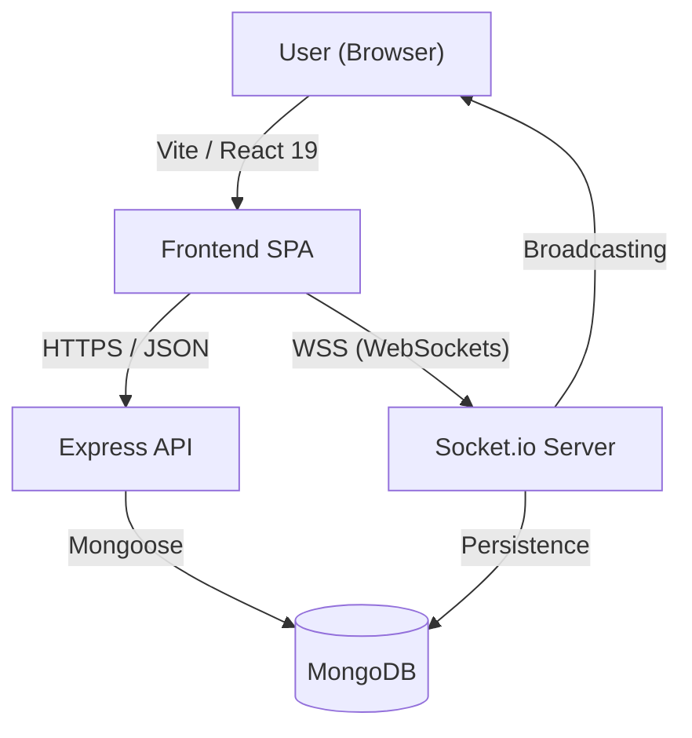

PROJECT FILE (CSF372)
FOR
Advance Topics in Front-End Engineering
Part of the degree of
BACHELOR OF TECHNOLOGY
In
CSE

Submitted to:            
Mr. Sunil Ghildiyal

Submitted by:
Name – Manas Arora (SAP ID – 1000019820)
Name – Koshika Singh (SAP ID – 1000020934)

Section – L

SCHOOL OF COMPUTING
DIT UNIVERSITY, DEHRADUN
2026

---

TABLE OF CONTENTS
S. No.	Contents
1	Introduction
2	Problem Definition
3	Existing System
4	Proposed System
5	System Requirements
6	Modules of System
7	Implementation
8	Sample Code
9	Test Cases
10	Results/Output Screens
11	Limitation of work
12	Future scope
13	References

---

1. Introduction
QuickChat is a real-time messaging application that allows multiple users to talk in channels or private direct messages with instant synchronization. Most chat tools today are either too heavy for quick team use or don't offer a clean, persistent way to store messages without paying for premium tiers.
This project provides a fast, responsive platform where users can join different chat rooms (channels) or search for other users to start a private talk. The system uses WebSockets to broadcast messages instantly as you type, and everything is saved so you don't lose your history.

The system is built using modern web technologies: 
• Frontend: React (v19), Vite, Tailwind CSS (v4), Framer Motion (animations), Lucide React (icons) 
• Real-time Communication: Socket.io-client 
• Backend: Node.js, Express.js, Socket.io server
• Database: MongoDB (for storing users, channels, and message history) 
• The design uses a component-based architecture with glass-morphic UI and real-time event updates.

2. Problem Definition
Most users still rely on fragmented tools for communication. Many existing chat platforms are either too complicated or have high latency. 
These create issues such as:
 • Difficulty in immediate synchronization between different users in a fast-paced environment.
 • High server lag for multi-user chat rooms during peak usage.
 • Lack of a lightweight interface that actually looks modern (glassmorphism).
 • Difficulty in searching through old message history in large channels.
 • Manual refreshing needed in older web applications to see new updates.
 • Increased cognitive load when switching between separate apps for group and private chats.
 • High battery and resource consumption of heavy enterprise chat frameworks.
 • No real-time feedback (like typing indicators) to show user presence.
Hence, a lightweight, real-time, integrated Chat Platform is required.

3. Existing System
The old messaging process typically involves: 
• Static web apps that require frequent refreshing to see new data.
• Using different apps for group chat and private messages which breaks workflow.
• Manual management of user lists and channel joining which is time-consuming.
• Legacy systems that don't persist data properly in a modern database like Mongo.
• Heavy dependency on paid cloud tiers just to see older message history.
• Unorganized layouts that make it hard to track long conversations.
• Lack of unified search across both channels and direct messages.


Limitations include: 
• High risk of missing important alerts or messages due to slow delivery.
• No real-time "typing" feedback to know if someone is actually active.
• Ugly or hard-to-use interfaces that distract users from the conversation.
• No single place for combined channel and private chat work in one tab.
• High latency in message propagation due to AJAX polling methods.

4. Proposed System
The proposed QuickChat application solves these problems by providing: 
• Instant room-based joining via unique channel names.
• Clean sidebar for switching between group channels and private DMs in one click.
• Real-time message sync and live typing indicators via Socket.io for a "live" feel.
• Automatic persistence of all chat history to MongoDB for 24/7 access.
• Integrated Universal Search tool to find any message or user instantly.
• Beautiful, animated UI with Glassmorphism using Tailwind CSS 4 and Framer Motion.
• In-app glassmorphic notifications for messages arriving in the background.
• Optimized state management using React 19 for faster re-renders.
• Responsive grid-based layout that works on all screen sizes.

Benefits: 
• True real-time multi-user collaboration without any delay.
• No lag between sending and receiving messages.
• Modern, premium look that feels professional and state-of-the-art.
• Automatic saving of data so history is never lost even after refreshing.
• Low resource footprint compared to heavy enterprise applications.

5. System Requirements: Hardware & Software Requirements
Hardware Requirements 
• Minimum 4 GB RAM (8 GB recommended) 
• Dual-core processor 
• 200 MB free disk space
• Active internet connection for WebSocket communication

Software Requirements 
• Operating System: Windows / macOS / Linux 
• Node.js (v18+) 
• MongoDB (local or cloud Atlas) 
• npm or yarn package manager
• Code editor (VS Code) 
• Web browser (Chrome/Edge) with WebSocket support

6. Modules of System
Real-Time Messaging Module 
• Socket.io room management per channel
• Instant broadcasting of messages and typing status
• Synchronization across all logged-in devices

Channel & DM Module 
• Create/Join channels for group work
• Private chat search and selection
• Unread message count badges for inactive windows

Search & Discovery Module
• Global search box to find specific keywords in messages 
• User search to start new private conversations
• Live result highlighting

Profile & Settings Module 
• Edit username and bio
• Instant Avatar randomization using DiceBear API
• Profile persistence in database

7. Implementation
The system is implemented as a **Single Page Application (SPA)** using a decoupled architecture that separates the UI layer from the real-time and persistence layers.

### 7.1 System Architecture Diagram
The following diagram illustrates the flow of data and the interaction between different components of the QuickChat system:



### 7.2 Technical Breakdown
- **Backend Architecture**: Express.js handles API routing for profile updates and message history, while Socket.io handles the persistent socket connection for real-time events.
- **Frontend Architecture**: A centralized state in `App.jsx` distributes data via props to `Sidebar` and `ChatWindow`.
- **Styling**: Utility-first CSS via Tailwind 4 with custom `backdrop-blur` configurations for a premium glassmorphic look.

Frontend (React + Vite) 
• Functional components using hooks (useState, useEffect, useRef) 
• Socket.io-client for real-time connection
• Modular design for Sidebar and ChatWindow
• Framer Motion for smooth transitions and modals
• Glass-morphic UI styling via Tailwind CSS 4

Backend (Node.js/Express + Socket.io) 
• REST API endpoints for fetching history and updating profiles
• Socket.io server for managing rooms and real-time broadcasts
• Protected routes using JWT tokens for security

Database (MongoDB) 
• users collection (profile data)
• channels collection (room metadata)
• messages collection (chat history)

8. Sample Code (Socket Setup)
```javascript
// Server side event handling
io.on('connection', (socket) => {
  socket.on('join_room', (roomId) => socket.join(roomId));
  socket.on('send_message', async (data) => {
    const newMessage = await Message.create(data);
    io.to(data.channelId).emit('receive_message', newMessage);
  });
});
```

9. Test Cases
| Test ID | Test Case Category | Input / Action | Expected Output | Status |
| :--- | :--- | :--- | :--- | :--- |
| TC-01 | Registration | New unique user details | Account created + JWT Token | Passed |
| TC-02 | Registration | Duplicate Username | Error: "Username already taken" | Passed |
| TC-03 | Registration | Already used Email | Error: "Email already registered" | Passed |
| TC-04 | Registration | Missing required fields | Form validation error | Passed |
| TC-05 | Login | Valid Email & Password | Redirected to Dashboard | Passed |
| TC-06 | Login | Incorrect Password | Error: "Invalid email or password" | Passed |
| TC-07 | Messaging | Send "Hello World" | Message appears for all room users | Passed |
| TC-08 | Messaging | Active Typing | Others see "User is typing..." | Passed |
| TC-09 | Discovery | Search keyword "API" | Correct list of filtered messages | Passed |
| TC-10 | Discovery | Search for missing user | Display "No users found" | Passed |
| TC-11 | Profile | Change bio & Save | New bio persists after refresh | Passed |
| TC-12 | Profile | Randomize Avatar | DiceBear seed updates instantly | Passed |
| TC-13 | Room | Join Channel "Devs" | Loaded last 50 messages of channel | Passed |

10. Results/Output Screens
• Login Page: Dark-themed glassmorphic card with blur effect.
• Dashboard: Multi-pane layout showing channels and user list.
• Chat Window: High-fidelity message feed with time stamps.
• Settings: Modal allowing profile updates and avatar changes.

11. Limitation of work
• Supports text-only messages currently; no support for rich text or Markdown formatting.
• No group members list visible in channels yet, making it hard to see who is joined.
• Requires server to be 100% online for any history fetch; no offline-first caching yet.
• No support for media files like images, videos, or PDFs for sharing.
• Lack of "Seen" or "Read" receipts for private direct messages.
• Manual avatar seed refresh is required; it doesn't auto-generate based on interest.
• Message history can become heavy on the initial load because it lacks infinite scrolling.
• No feature to edit or delete a message once it has been sent to the server.

12. Future scope
• Adding full file and image sharing using AWS S3 or Cloudinary integration.
• Voice and Video calling features using WebRTC for better team collaboration.
• End-to-end encryption (E2EE) for private DMs to ensure maximum data privacy.
• Real-time message editing and deletion functionality for users.
• Browser-level Push Notifications to alert users when the tab is closed.
• Integration of "Online/Offline" status indicators for every user in the sidebar.
• Implementing "Reactions" (Like, Heart, Laugh) for specific message bubbles.
• Advanced Search indexing using MongoDB Atlas Search for faster keyword matching in big data.
• Developing a native mobile version using React Native for iOS and Android support.

13. References
• React: https://react.dev
• Socket.io: https://socket.io
• MongoDB: https://mongodb.com
• Tailwind CSS: https://tailwindcss.com
• Framer Motion: https://framer.com/motion
• Lucide Icons: https://lucide.dev
• MDN Web Docs: https://developer.mozilla.org
