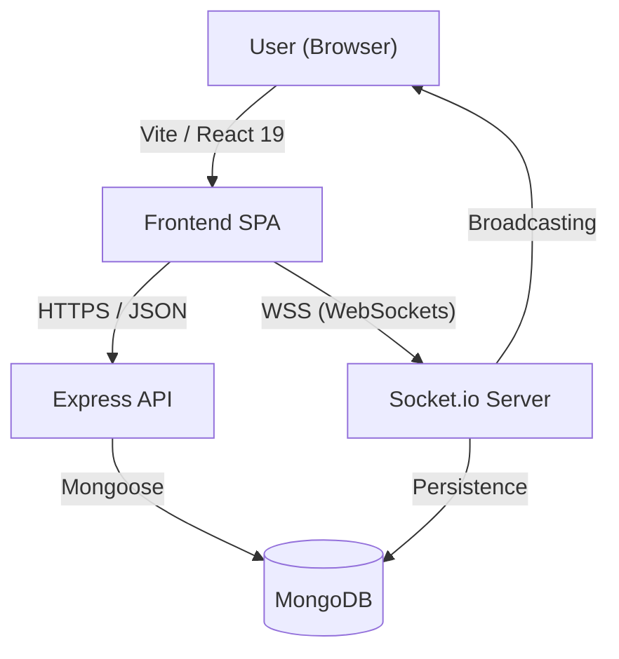

# 🏛️ QuickChat: Ultimate Engineering Documentation

Welcome to the definitive guide for the **QuickChat** platform. This document covers everything from high-level architecture to low-level API specifications and component interfaces.

---

## 🗺️ System Overview

QuickChat is a full-stack real-time messaging ecosystem. It leverages a **Reactive Frontend** and an **Event-Driven Backend**.

---

## 📦 Tech Stack & Dependencies

### Core Modern Frameworks
- **React 19**: Utilizing `Concurrent Rendering`, `Server Actions` logic for state, and `Suspense`.
- **Express 5**: The routing engine for all RESTful interactions.
- **Socket.io 4**: The real-time abstraction layer for WebSocket communication.
- **Tailwind CSS 4**: Next-gen CSS engine for lightning-fast styling.

### Key Libraries
- **Framer Motion**: Hardware-accelerated UI animations.
- **Lucide React**: Modern, scalable SVG iconography.
- **Bcrypt & JWT**: Industry-standard security for password hashing and session tokens.
- **DiceBear API**: Dynamic avatar generation.

---

## 📡 API Reference

### Authentication (`/api/auth`)
| Endpoint | Method | Description | Body |
| :--- | :--- | :--- | :--- |
| `/register` | `POST` | Create a new user account | `{username, email, password}` |
| `/login` | `POST` | Authenticate and get JWT | `{email, password}` |
| `/users` | `GET` | List all available users | `null` |
| `/search` | `GET` | Search users by name | `query (?q=...)` |
| `/profile` | `PUT` | Update user profile | `{username, bio, avatar}` |

### Channels (`/api/channels`)
| Endpoint | Method | Description | Body |
| :--- | :--- | :--- | :--- |
| `/` | `GET` | Fetch all public/joined channels | `null` |
| `/` | `POST` | Create a new channel | `{name, description, isPrivate}` |
| `/:id/messages` | `GET` | Fetch message history | `null` |
| `/:id/members` | `POST` | Invite user to channel | `{userId}` |
| `/:id/search` | `GET` | Search messages in channel | `query (?q=...)` |

### Messages (`/api/messages`)
| Endpoint | Method | Description | Body |
| :--- | :--- | :--- | :--- |
| `/:userId` | `GET` | Fetch DM history with user | `null` |
| `/:userId/search` | `GET` | Search messages in DM | `query (?q=...)` |

---

## 🔌 WebSocket Events (Socket.io)

| Event | Direction | Data | Description |
| :--- | :--- | :--- | :--- |
| `join_room` | Client -> Server | `roomId` | Subscribes the user to a channel or DM stream. |
| `send_message` | Client -> Server | `messageData` | Sends a message; triggers DB persistence & broadcast. |
| `receive_message` | Server -> Client | `messageObject` | Pushes a new message to all subscribers in the room. |
| `typing` | Client -> Server | `typingContext` | Notifies others that the user is entering text. |
| `user_typing` | Server -> Client | `typingData` | Displays the "Alice is typing..." indicator. |

---

## 🏗️ Reusable Component Library

### 1. `Modal.jsx`
- **Props**: `isOpen`, `onClose`, `title`, `children`.
- **Visuals**: Uses `AnimatePresence` for smooth exit transitions and a `backdrop-blur` background.

### 2. `EmojiPicker.jsx`
- **Props**: `onSelect`, `isOpen`, `onClose`.
- **Features**: Category-based filtering, keyword search, and reactive hover states.

### 3. `NotificationToast.jsx`
- **Props**: `notifications`, `removeNotification`.
- **Animations**: Uses layout animations via `framer-motion` to shift multiple toasts dynamically.

---

## 🗄️ Database Schema (Mongoose)

### **User Schema**
- `username` (String, Unique, Required)
- `email` (String, Unique, Required)
- `password` (String, Hashed)
- `avatar` (String, DiceBear URL)
- `bio` (String, Default: "")

### **Channel Schema**
- `name` (String, Required)
- `description` (String)
- `isPrivate` (Boolean)
- `members` (Array of ObjectIDs -> Users)
- `createdBy` (ObjectID -> User)

### **Message Schema**
- `content` (String, Required)
- `sender` (ObjectID -> User, Required)
- `channel` (ObjectID -> Channel, Optional)
- `recipient` (ObjectID -> User, Optional)
- `isRead` (Boolean)

---

## 🧪 Operational Workflow

### Local Development
1. Start MongoDB.
2. Configure `.env`.
3. Run `npm install`.
4. Run `npm run dev` to start both Vite (Port 3000) and Express (Port 5000) concurrently.

### Production Environment
1. Run `npm run build` to generate the static dist.
2. Server `server/index.js` will automatically detect `NODE_ENV=production` and serve the static files via Express.
3. Ensure path-rewrite rules are active for SPA routing.
